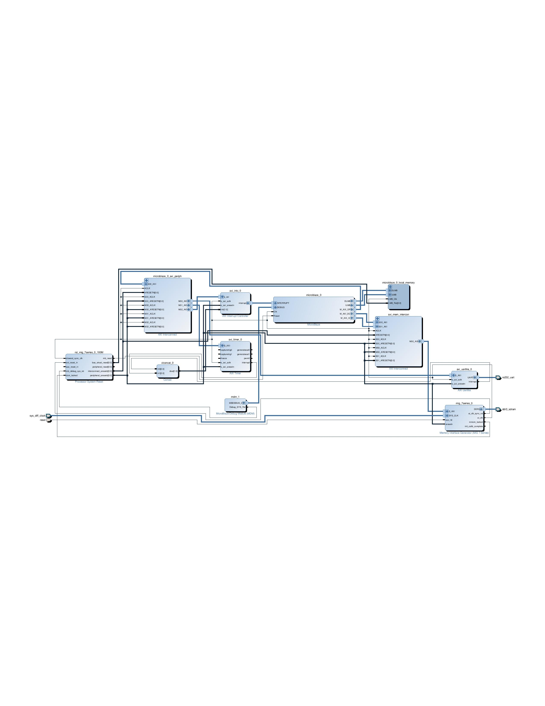
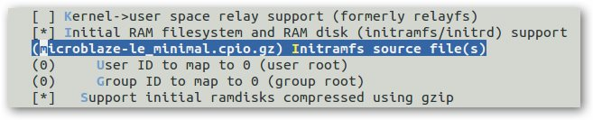
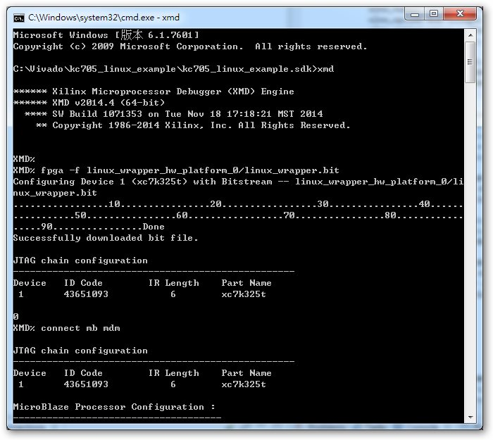
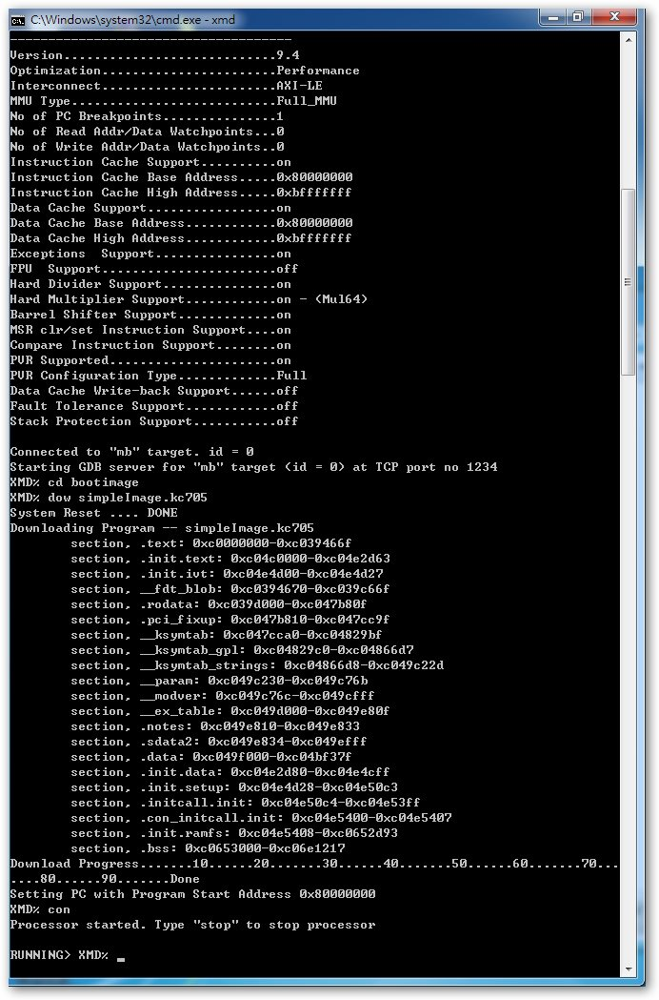
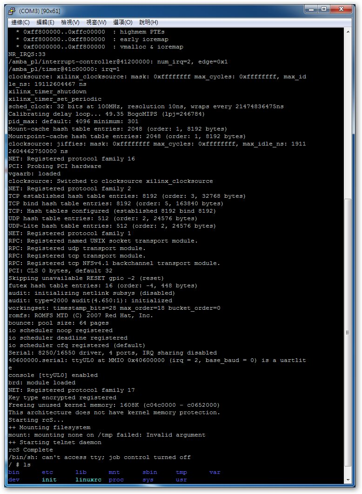

# Booting Linux on Microblaze under Kintex 7 FPGA board
---
### Introduction

This article describe detailed step to boot linux on microblaze under Xilinx kintex 7(kc705).

Microblaze is a processor which support booting linux, and also a soft processor, which mean that it can be wholly implemented on FPGA. Those feature make microblaze a great research target.

However, I found there is no such article on Internet describe how to boot linux on kc705, and I spent lot of time trying to figure out how to do it, I decide to write a tutorial about this. 

I am building hardware bitstream using Vivado 2014.4, installing toolchain and compiling linux kernel under ubuntu 14.04. However, version is not main point.

This article assume reader familiar with Xilinx Vivado and cross compiling.

### Contents

* Building Hardware Bitstream
* Generate Device-Tree
* Compiling Linux Kernel
* Running on targeted board

### Building Hardware Bitstream

To boot linux on microblaze, we have to build a simple hardware platform which contain microblaze processor and other peripheral, set them to correct configuration.  

The final diagram should look like:

Let us bypass how to create project, just starting from a new blank block diagram, now is the time to add IP.

Here is my step:
    
1. add IP -> Memory Interface Generator(MIG)
2. add IP -> Microblaze
3. add IP -> uart
4. add IP -> axi_timer
5. add IP -> axi_intc
6. automation
6. add IP -> concat
7. connect uart interrupt port and timer interrupt port to concat input port, connect concat output port to intc Intr input port.
8. connect intc interrupt output port to microblaze interrupt input port
9. validate design

It is not necessary to follow my step, you only have to make sure that the final diagram is same as above one.

Now we start to setup the hardware configuration, double click microblaze and select `Linux with MMU`, click finish. Double click uart and select baud rate to `115200`.

You may add ethernet related IP if you want.

Everything get done, we can start to generate bitstream. `Generate Output Products` them `Create HDL Wrapper` them `Generate Bitstream`.

### Generate Device-Tree

This is much easier.

First clone the Xilinx device-tree-xlnx project, make sure the version is same as your Vivado.

> git clone https://github.com/Xilinx/device-tree-xlnx.git

Open SDK, select Xilinx Tools -> Repositories, new a local repositories by select your clone directory, them select OK. 

Now we can generate device tree by new a board support package.

If you do not understand what I am saying, just follow [xilinx wiki page](http://www.wiki.xilinx.com/Build+Device+Tree+Blob).

Here is my example device-tree: [kc705.dts](kc705.dts) and [pl.dtsi](pl.dtsi).

### Compiling Linux Kernel

Now is the time to compile kernel.

* Microblaze toolchain

	First, you have to know that if there is microblaze toolchain in you host computer.

	Check /opt/Xilinx/SDK/ exist or not, if there is no such thing them you have to install Xilinx SDK in your host computer to get the microblaze toolchain, or maybe you can clone microblaze toolchain from other people.

* Clone linux kernel source code

	> git clone https://github.com/Xilinx/linux-xlnx.git linux

* Configure kernel

	> cd linux/  
	> make ARCH=microblaze mmu_defconfig  

* Advanced configure kernel

	> make ARCH=microblaze menuconfig   

	Make sure that Platform option is correct

		Platform options --->
 		     (<kernel load address>) Physical address where Linux Kernel is
 		     (1) USE_MSR_INSTR range (0:1)
 		     (1) USE_PCMP_INSTR range (0:1)
 		     (<0|1>) USE_BARREL range (0:1)
 		     (<0|1>) USE_DIV range (0:1)
 		     (<0|1|2>) USE_HW_MUL values (0=NONE, 1=MUL32, 2=MUL64)
 		     (<0|1|2>) USE_FPU values (0=NONE, 1=BASIC, 2=EXTENDED)

	Reference to device tree, note that if you are using XPS rather than Vivado, please reference to system.mhs.

		xlnx,use-msr-instr = <0x1>;
		xlnx,use-pcmp-instr = <0x1>;
		xlnx,use-barrel = <0x1>;
		xlnx,use-div = <0x1>;
		xlnx,use-hw-mul = <0x2>;
		xlnx,use-fpu = <0x0>;

	and make sure `CONFIG_KERNEL_BASE_ADDR` is same as your memory base address.

* Device tree

	copy your device tree(pl.dtsi, system.dts) to arch/microblaze/boot/dts, and I just rename system.dts to kc705.dts.

* Root file system

	download prebuilt root file system from this [page](http://www.wiki.xilinx.com/Build+and+Modify+a+Rootfs), choose this one `microblaze-le_minimal.cpio.gz` cause we are building an AXI microblaze system(little endian).

	and setup configuration again:

	> make ARCH=microblaze menuconfig  

	Enable `General setup -> Initial RAM filesystem and RAM disk (initramfs/initrd) support`

	and key in name of your previous download foot file system.

	

* Compiling kernel

	> export CROSS_COMPILE=microblazeel-xilinx-linux-gnu-  
	> make -j 4 ARCH=microblaze simpleImage.kc705

	Note that cross compiler is `microblazeel` rather than `microblazel`, `microblazeel` is for little endian and `microblaze` is for big endian. In our case we are building AXI Microblaze(little endian).

	`-j` option is for multiple build jobs, you can get speedup if you are in multi-core environment.

	If there is mkimage error, just comment out arch/microblaze/boot/Makefile

		#$(call if_changed,uimage)

	Now we get the image(simpleImage.kc705) under arch/microblaze/boot, it is time to boot on target board.

### Running on targeted board

Open Xilinx SDK, Xilinx Tools -> lanuch Shell.

> xmd  
> fpga -f linux_wrapper.bit  
> connect mb mdm  
> dow simpleImage.kc705  
> con  

After about ten seconds, UART will show kernel booting processing. 

### Reference

1. [xilinx wiki](http://www.wiki.xilinx.com/)
2. [linux-xlnx](https://github.com/Xilinx/linux-xlnx)
3. [device-tree-xlnx](https://github.com/Xilinx/device-tree-xlnx)
4. [Skoll, Microblaze And Linux: How To Run Linux On Skoll Kintex 7 FPGA Module](https://docs.numato.com/kb/skoll-microblaze-linux-run-linux-skoll-kintex-7-fpga-module/)
5. [Linux on Microblaze HOWTO](http://billauer.co.il/blog/2011/08/linux-microblaze-howto-tutorial-primer-1/)
6. [Linux on the Xilinx KC705 Kintex™-7 FPGA development Board](https://wiki.analog.com/resources/eval/user-guides/ad-fmcomms1-ebz/software/linux/microblaze_kc705?rev=1450387094)
7. [Running Linux on Microblaze Processor](https://binarypirates.wordpress.com/2011/12/02/running-linux-on-microblaze-processor/)